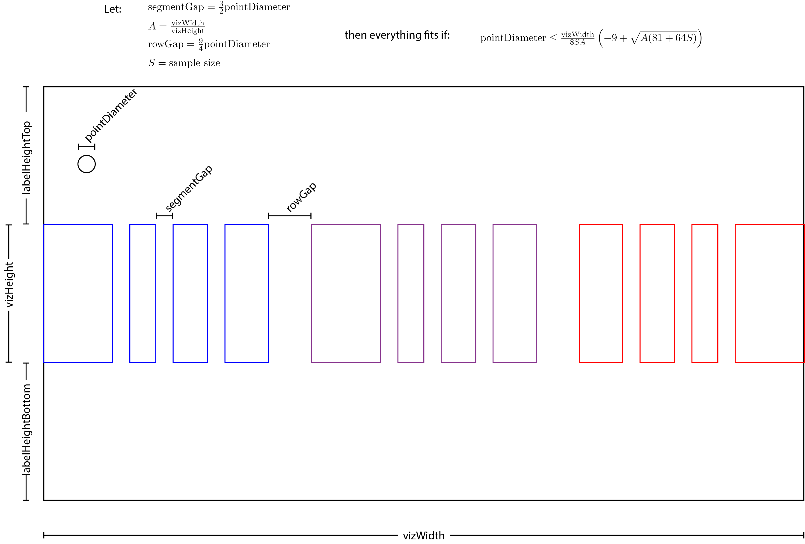

# Overview

Scripts in this folder take the raw data from the .gz files and build synthetic samples for use in the app. The synthetic samples will assign coordinates to each datapoint, so that less code needs to run on the client to calculate these coordinates.

Each section in this files focuses on one visualization tool in the app, describing the sample used in the tool, the views the tool supplies, the coordinates needed for each point in each view, how those coordinates are calculated by the script, and how the runtime code can use those coordinates to build the views.

# Importance Tool

## Visual Design and Structure

Everthing in this tool is a horizontal segment viz -- i.e. it's nothing but (segmented-by-imp-response) rows of points.

We'll build the tool as a stacked column of HTML 5 canvases, ONE canvas for each democratic principle. (The runtime can then filter and sort the principles by filtering and sorting the canvases.)

The sample will be organized by principle. (See the Sample section below.) In effect, there is ONE sample FOR EACH principle, with all of these samples stored in a single JSON file, as if its all one sample.

Given this design, everything we write in the following is written about the canvas/sample/coordinates _for any given single principle_.

The most basic view, which below we call _unsplit_, has one canvas for each principle, with the canvases stacked vertically. Within each canvas, there is one un-segmented row showing all points in the sample.

The extention of this very basic view, _split by response_, has one canvas for each principle, with the canvases stacked vertically. Within each canvas, there is one _segmented_ row, with one segment for each response, with sampled points grouped into segments by their responses.

The _split by response_ view can be split by party, to make the _split by response AND party_ view. In the canvas for any one principle in this view, there will be THREE rows of segments, laid out horizontally within the canvas. -- democrat row on the left, independent+other row in the middle, republican row on the right.

(add option to "compare party" on a given principle -- rotating the rows to columns???)

Each of the _split by response_ view and the _all principles, split by response AND party_ view can be "split by wave". In any "split by wave" view, there is (like all the other views), one canvas for each principle, with the canvases stacked vertically. Within each canvas, there are multiple segmented rows of points, one row for each wave. (Null waves on any one principle have space allocated for a row of points, but no row of points rendered in that space.) At each wave, there is one row of points in the case of the _split by response AND wave_ view, and three horizontally-laid-out rows points in the case of the _split by response AND wave AND party_ view.

Finally, each view that is _split by response_, is further split into two sub-views: _expanded_ and _collapsed_. It the _expanded_ view, each row of points is split into 4 segments -- one for each response to the imp questions. In the _collapsed_ view, each row of points is split into 2 segments -- one for the bottom two responses, one for the top two responses.

## Element dimensions



The diagram above shows dimensions for a split-by-party view. Split-by-party is the most difficult view to fit, since it affords the least amount of horizontal space for points, while requiring the largest amount of points fit within that space. The inequality in the diagram specifies a tight upper bound on the point diameter, given the 'vizWidth', sample size (total number of points in the viz), and aspect ratio (width-to-height) of the row of segments.

The tightest canvas width we will design for is 360 pixels. This allows for an iPhone SE in portrait orientation, with about 7.5 px of padding/margin on each side of the viz. For sample size, we'll want to have 100 points per party per wave, which comes to 1200 points total. Finally, we'd like ratio of vizWidth to vizHeight (as those lengths are defined in the diagram above) of 16:9. Applying the formula above, one finds that this can work with a point diameter of about 7.5 or less.

We will build for four screen-width ranges, assigning a fixed width to the canvas on which points will be arrayed for each range. In addition to fixing the width of the canvas at each range, we also need to fix the other free parameters described in the diagram above.

- **SMALL SCREENS**, defined as width < 768px. (The narrowest ipad is 760px wide.).
  - **vizWidth** 360px.
  - **A** 16/9.
  - **pointRadius** 3px. (0.5\*pointDiameter, of course)
  - **segmentGap** (3/2)\*pointRadius
  - **rowGap** (9/4)\*pointRadius
  - **labelHeightTop** 30px
  - **labelHeightBottom** 30px

- **MEDIUM SCREENS**, defined as 768px <= width < 1024px (ipads are in this range in portrait mode. The largest ipad hits 1024 in landscape mode)
  - **vizWidth** 760px.
  - **A** 16/9
  - **point radius** 4px.
  - **segmentGap** (3/2)\*pointRadius
  - **rowGap** (9/4)\*pointRadius
  - **labelHeightTop** 30px
  - **labelHeightBottom** 30px

- **LARGE SCREENS**, defined as 1024px <= width < 1200px (laptops tend to be 1024+. We put a max width on our app of 1200px)
  - **vizWidth** 1020px.
  - **A** 16/9
  - **point radius** 4px.
  - **segmentGap** (3/2)\*pointRadius
  - **rowGap** (9/4)\*pointRadius
  - **labelHeightTop** 30px
  - **labelHeightBottom** 30px

- **XL SCREENS**, defined as 1200px <= width. (We put a max width on our app of 1200px).
  - **vizWidth** 1180px.
  - **A** 16/9
  - **point radius** 4px.
  - **segmentGap** (3/2)\*pointRadius
  - **rowGap** (9/4)\*pointRadius
  - **labelHeightTop** 30px
  - **labelHeightBottom** 30px

## Coordinate system

As mentioned above, in every view, each principle will have it's own canvas, so the coordinates for any given point will be relative to the canvas it belongs to.

To pin down the location of a point in any one canvas, we'll use x coordinates that range from 0 to vizWidth.

The y coordinate system will depend on whether we are working with a _split by wave_ view.

For a view that is NOT split-by-wave, y coordinates will range from 0 to labelHeightTop + vizWidth/A + labelHeightBottom.

For a view that IS split-by-wave...let W be the number of waves (it happens to be that W=4). Then Y coordinates range from 0 to W\*(labelHeightTop + vizWidth/A + labelHeightBottom).

## Sample

For a given postive integer constant `SAMPLESIZE` (e.g. `const SAMPLESIZE = 100`), we construct ONE sample FOR EACH of the democratic principles as follows:

For each survey wave in which the principle was included, we sample:

- `SAMPLESIZE` persons from the set of persons who responded to principle's imp question AND responded `pid3 === 'Republican'`
- `SAMPLESIZE` persons from the set of persons who responded to principle's imp question AND responded `pid3 === 'Democrat'`
- `SAMPLESIZE` persons from the set of persons who responded to principle's imp question AND responded `pid3 === 'Independent' || pid3 === 'Other'`

Notice that this means that for each principle-wave, the sample size is `3*SAMPLESIZE`, and for each principle, the total samplesize is `12*sampleSize`.

The structure of the JSON containing the generated sample for any given screensize is like this:

```JSON
{
  "imp_votes_impact": {
    "w01": [], //this is what we put for a principle not included in the given wave
    "w02": [
      // ...sample of responses to imp_votes_impact from wave 02 here...
    ],
    //...more waves...
  },
  "imp_private_violence": {
    "w01": [
      // ...sample of responses to imp_private_violence from wave 01 here...
    ],
    "w02": [
      // ...sample of responses to imp_votes_impact from wave 01 here...
    ],
    //...more waves...
  },
  // ...more principles...
}
```

Each sample response (i.e. each element of the wave arrays like `"w01": []`) is an object like this:

```JSON
{
  "response": "Beneficial",
  "pid3": "Republican",
  "unSplit": {"x": 1.3, "y":4.3, "cx": 452.3, "cy": -60}
  "byResponse": {
    "expanded": {"x": 1.3, "y":4.3, "cx": 12.4, "cy": 127},
    "collapsed": {"x": 1.3, "y":4.3, "cx": 82, "cy": 0.072}
  },
  "byReponseParty": {
    "expanded": { "x": 1.3, "y":4.3, "cx": 1, "cy": 84},
    "collapsed": { "x": 1.3, "y":4.3, "cx": 2, "cy": -673.2}
  },
  "byReponseWave": {
    "expanded": { "x": 1.3, "y":4.3, "cx": 1, "cy": 84},
    "collapsed": { "x": 1.3, "y":4.3, "cx": 2, "cy": -673.2}
  },
  "byReponseWaveParty": {
    "expanded": { "x": 8, "y":4.3, "cx": 1, "cy": 84},
    "collapsed": { "x": 4, "y":4.3, "cx": 2, "cy": -673.2}
  }
}
```

`cx` and `cy` give the coordinates for the centers of the circles. `x` and `y` offset from the center by `pointRadius` for the given config, so that you can place images that contain circles, instead of using canvas elements.

## Views

Views:

- **DATA GEN CODE DONE** all principles, unsplit
- **DATA GEN CODE DONE** all principles, split by response, expanded
- **DATA GEN CODE DONE** all principles, split by response, collapse
- all principles, split by response AND party, expanded
- all principles, split by response AND party, collapsed
- all principles, split by response AND wave, expanded
- all principles, split by response AND wave, collapse
- all principles, split by response AND wave AND party, expanded
- all principles, split by response AND wave AND party, collapsed
